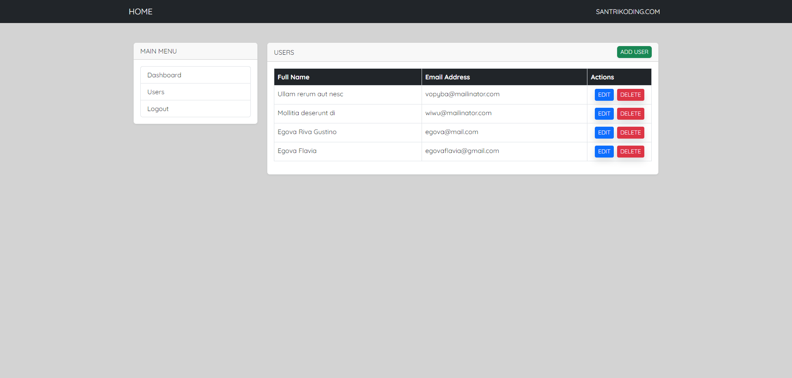

# Frontend Vue - Fullstack JavaScript Developer

Aplikasi frontend ini adalah bagian dari kursus **Fullstack JavaScript Developer dengan Express dan Vue** dari SantriKoding.



## Deskripsi

Proyek ini menampilkan antarmuka admin berbasis Vue yang biasanya digunakan untuk latihan CRUD pengguna. Di dalamnya terdapat:

- Navigasi sidebar dengan menu `Dashboard`, `Users`, dan `Logout`
- Halaman utama `Users` dengan tabel data pengguna
- Tombol `ADD USER`, `EDIT`, dan `DELETE`
- Desain sederhana untuk fokus pada integrasi frontend dan backend

## Teknologi

- Vue 3
- Vite
- JavaScript

## Instalasi

1. Pasang dependensi:
   ```bash
   npm install
   ```
2. Jalankan development server:
   ```bash
   npm run dev
   ```

## Struktur Folder

- `src/` - kode sumber Vue
- `src/components/` - komponen UI
- `src/views/` - halaman aplikasi
- `src/services/api.js` - helper API
- `public/` - aset publik

## Catatan

Aplikasi ini adalah frontend.Denga Backend Express yang terpisah, Anda dapat menghubungkan API untuk melakukan operasi CRUD pada data pengguna. Pastikan backend berjalan di port yang sesuai agar frontend dapat berkomunikasi dengan benar.

## Backend

- Backend Express untuk proyek ini berasal dari repository:
  https://github.com/egovaflavia/backend-express

Silakan clone atau letakkan backend di folder terpisah seperti `backend-express` agar integrasi API dapat dijalankan bersamaan.
